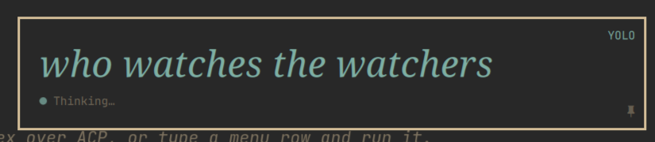
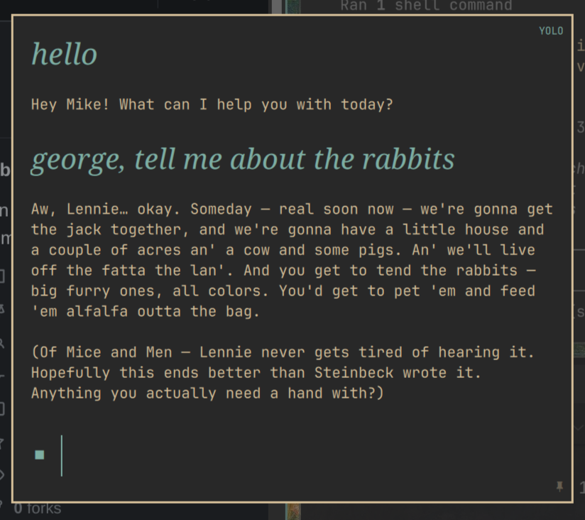
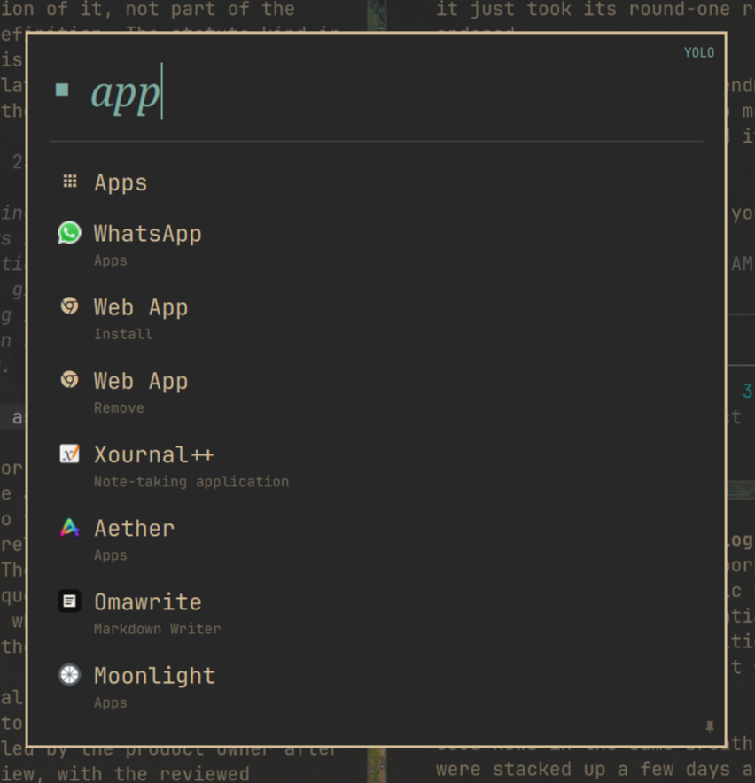

# Omarchy Ask

An AI-enabled launcher for Omarchy.







- **One box, two jobs.** Type a question for Claude Code or Codex over ACP, or type a menu row and run it.
- **Your menu, live.** Ask reads the same definitions the `SUPER+SPACE` menu does, so anything you add there shows up here the moment you save it.
- **Launches apps too.** Same entries, icons and ranking as the app launcher, in one flat list.
- **Return means what you meant.** Type and hit Return to ask; arrow onto a match first and Return runs it instead.
- **Zero residue.** Conversations exist only while the overlay is open.
- **Pin it.** `Ctrl+P` turns a live conversation into a normal window.
- **Your size.** `Ctrl` `+` / `-` resizes everything, and remembers.

## Requirements

- Omarchy Quattro 4.0.0 or newer with the Quickshell-based Omarchy Shell
- Node.js and npm
- A working Claude Code or Codex login

Omarchy Ask is not compatible with Omarchy 3 and its Waybar-based desktop. It
is currently verified on Omarchy `4.0.0-1`; later Quattro releases are intended
to remain compatible through the public shell-plugin contract.

## Install

```sh
omarchy plugin add https://github.com/clickety-clacks/omarchy-ask.git --enable --yes
cd ~/.config/omarchy/plugins/clickety-clacks.ask/bridge
npm ci
```

Add a Hyprland binding to `~/.config/hypr/bindings.lua`:

```lua
o.bind("CTRL + SHIFT + SPACE", "Ask", "omarchy-shell shell toggle clickety-clacks.ask '{}'")
```

To let Ask receive chords that are globally bound in Hyprland, define a modal
submap and enable it in `ask.json`:

```lua
hl.define_submap("omarchy-ask", function()
  hl.bind("SUPER + comma", hl.dsp.exec_cmd("omarchy-shell shell call clickety-clacks.ask openHarnessSelector '{}'"))
  hl.bind("CTRL + SHIFT + SPACE", hl.dsp.exec_cmd("omarchy-shell shell toggle clickety-clacks.ask '{}'"))
  hl.bind("SUPER + ESCAPE", hl.dsp.submap("reset")) -- crash-safe escape hatch
end)
```

```json
{ "useHyprlandShortcutSubmap": true }
```

Ask's manager serializes entry and reset for the current layer popup only; a
pinned or older conversation cannot reset a newer overlay's submap. Startup
also resets a stale `omarchy-ask` submap left by an earlier shell failure.
Normal global bindings remain registered and untouched. Leave the setting
false unless the matching Hyprland submap exists. `SUPER+ESCAPE` is the
out-of-process recovery path after a hard shell crash.

Then reload Hyprland:

```sh
hyprctl reload
```

## Remove

Remove the plugin and delete the `Ask` binding you added to
`~/.config/hypr/bindings.lua`:

```sh
omarchy plugin remove clickety-clacks.ask
hyprctl reload
```

Ask leaves its small preferences file in place so reinstalling preserves your
settings. Remove it too if you want to clear all Ask state:

```sh
rm ~/.config/omarchy/ask.json
```

## Agent, model, and working directory

Without a saved override, Ask follows Omarchy’s Default Agent and that system
harness’s model and thinking settings. Ask launches the system Codex or Claude
executable from `PATH`; it never falls back to a bundled harness. Explicit
`CODEX_PATH` and `CLAUDE_CODE_EXECUTABLE` launch overrides remain supported.
Set `ASK_CWD` to choose the working directory; otherwise Ask uses `$HOME`.

Press `Super+,` in Ask to choose the harness, model, and thinking level used
by new conversations. The selection is stored in `ask.json` and takes priority
over Omarchy’s default. Choose “Omarchy default” to remove the Ask override.
Existing conversations keep their current ACP session. After a connection
failure, “Start new session” uses the latest selection. Previous text stays
visible, but is not replayed to the new agent. Missing or unsupported harnesses
show a recovery message instead of starting an onboarding flow.

Ask historically runs its bridge with `node` from `PATH` and launches the ACP
adapter installed in `bridge/node_modules`. Deployments can replace both paths
without proxy processes or shell parsing: `ASK_BRIDGE_COMMAND` is a JSON argv
prefix for running `bridge.js`, and `ASK_ACP_COMMAND` is the complete JSON argv
for the adapter. For example, the latter may be
`["mise","exec","--","codex-acp"]`. Harness-specific deployments may use
`ASK_CODEX_ACP_COMMAND` and `ASK_CLAUDE_ACP_COMMAND`; these take priority over
the legacy shared `ASK_ACP_COMMAND`. `ASK_AGENT` still selects protocol behavior
and display name; executable selection belongs to the deployment.

Pinned conversations use the native Qt window's attention request when a reply
finishes while unfocused. Hyprland receives urgency for that exact window;
optional services such as Yoohoo can consume it without any Ask integration.
No attention service or `ASK_ATTENTION_COMMAND` configuration is required.
Pinned content draws no outer frame or rounded mask: Hyprland owns the border,
rounding and clipping. The transient overlay retains its themed frame.

Each conversation starts its own ACP bridge and session and reuses them for
every turn. Pinning retains that exact process and session in a normal window;
opening Ask again creates an independent conversation.

## Controls

- `Return`: submit
- While Codex is working, type a correction and press `Return` to steer the
  active turn. Ask enables this only when the ACP agent advertises steering.
- `Shift+Return`: insert a newline
- `Ctrl+W`: delete the word before the caret; `Ctrl+E`: jump to the end of the prompt
- `Escape`: close and discard the session (overlay only — a pinned window closes
  like any other window, through your window manager)
- `Arrow keys` or `Ctrl+H/J/K/L`: scroll the conversation
- `PageUp/PageDown` or `Ctrl+U/D`: scroll by page
- `Ctrl+=` / `Ctrl+-`: grow or shrink the conversation text
- `Ctrl+0`: return the conversation text to its default size
- `Ctrl+1` through `Ctrl+0`: move selection to the corresponding visible
  result (first through tenth); repeat the same shortcut to perform its normal
  Return action, or press Return/modifier+Return for a specific action
- `Ctrl+,`: open the live scroll-motion curve editor beside Ask; drag its
  endpoint to choose coast distance and duration directly
- `Super+,`: choose the harness, model, and thinking level for new
  conversations; Return saves and Escape cancels
- Arithmetic, functions, aggregates such as `sum 10 34 100`, and unit
  conversions such as `10 km in miles` appear as the first suggestion even
  inside ordinary prose. Selecting the row copies its answer.
- Matching files and Git repositories appear as compact aggregate suggestions.
  Select one to enter its inline result mode, or start with `@` for files, `^`
  for repositories, and `%` for open windows. The prompt marker changes to the
  boxed mode sigil; Backspace on an empty mode query returns to normal search.
  File and repository searches cover the user's full home directory by
  default. Set `ASK_FILE_ROOT` in the shell environment to intentionally limit
  both indexes to a different directory. Repository discovery defaults to six
  directory levels; set `repoSearchDepth` in `ask.json` to another depth, or
  to `0` for unlimited traversal. `ASK_REPO_SEARCH_DEPTH` overrides that value.
  Terminal windows are enriched from their process trees, including SSH/Mosh
  hosts and tmux session names, and `%` results are grouped by workspace.
  Focused-mode results use a bounded scrolling viewport and retain the complete
  backend match set (up to 100 files/repositories and 40 windows).
- Mouse selection and `Ctrl+C`: copy conversation text
- `Ctrl+V`: paste into the prompt
- `Y` / `N`: allow or deny a pending tool request
- `Ctrl+P` or the pin icon: move the live conversation into a normal resizable
  window

Pinned conversations remain open with their own agent sessions. Invoking the
Ask shortcut again opens a fresh overlay instead of dismissing pinned windows.

Text size applies to every conversation, in the overlay and in pinned windows
alike, and is remembered across restarts.

The text control in the upper-right is persistent. **Ask** requests permission
before tools run; **YOLO** automatically selects the ACP agent's one-time allow
option. Ask is the default until you explicitly select YOLO. The selection is
stored in `~/.config/omarchy/ask.json` and is shared by new conversations.

YOLO is intentionally conspicuous because it permits agent tools to run
without another click. It does not grant capabilities the underlying agent
lacks, alter its sandbox, or manufacture an allow option when the ACP agent
does not offer one.

## Conversation behavior

- The `▪` marker identifies the input line; it is not sent to the agent.
- ACP `messageId` boundaries become separate assistant paragraphs.
- Paragraph breaks inside an assistant reply are rendered with a blank line
  between them. Fenced code and list structure are left as the agent wrote them.
- Submitting glides the new prompt to the top of the viewport and lets the
  reply fill the space beneath it. A prompt submitted while you are scrolled up
  in the history never moves the viewport.
- Assistant growth follows the bottom only if the viewport was already there.
- Closing an overlay or pinned window ends only that conversation and its ACP
  process.
- The global shortcut toggles the active overlay. Pinned windows are never
  dismissed by that shortcut.
- Markdown links open through the desktop's external URL handler.

## Your menu is already in it

Ask keeps no list of its own — it reads the menu's own definitions, including
the `when:` conditions that decide what applies right now. Install a plugin
that adds a menu row and the row is in Ask too, without either of them knowing
about the other.

- `Down`/`Up` or `Tab`/`Shift+Tab`: move through matches
- `Return`: run the selected row, or submit a prompt when nothing is selected
- `Escape`: drop the selection (the overlay's own `Escape` still closes it)

Choosing a submenu opens it in the real menu; choosing an application launches
it. Either way the overlay gets out of the way.

Matching waits for a pause in typing so the card resizes once rather than on
every keystroke. Tune that with `searchDebounceMs` in
`~/.config/omarchy/ask.json` — milliseconds, `270` by default, `0` to match
immediately. The file is watched, so an edit applies without a restart.

File opening and editing can optionally be delegated to separate commands in
the same file. Commands are argv arrays; Ask appends the selected path as the
final argument and does not invoke a shell:

```json
{
  "fileOpenCommand": ["rifle", "-c", "/home/me/.config/rifle/view.conf"],
  "fileEditCommand": ["rifle", "-c", "/home/me/.config/rifle/edit.conf"]
}
```

Either setting may instead be a single executable string. When absent or
empty, Return retains `xdg-open` and Alt+Return retains
`omarchy-launch-editor`; Rifle is optional and is not an Ask dependency.

## Local state

Ask keeps no transcript archive. Conversation text and ACP session state live
only in their conversation process and disappear when its window is closed. The
durable application state, including optional file open/edit commands, is held
in:

```text
~/.config/omarchy/ask.json
```

The coding-agent CLIs may maintain their own logs or session data according to
their own configuration; Omarchy Ask does not manage or erase that data.

## Troubleshooting

### The overlay does not start

Install the bridge dependencies and confirm the chosen agent is authenticated:

```sh
cd ~/.config/omarchy/plugins/clickety-clacks.ask/bridge
npm ci
claude --version                    # default agent
# or: codex --version               # when ASK_AGENT=codex
```

### Changes or a new version do not appear

Update the git-managed plugin, reinstall dependencies if the lockfile changed,
and restart the long-lived shell process:

```sh
omarchy plugin update clickety-clacks.ask --yes
cd ~/.config/omarchy/plugins/clickety-clacks.ask/bridge && npm ci
omarchy restart shell
```

### A tool appears stuck

In Ask mode, look for the centered permission dialog and answer with its
buttons or `Y` / `N`. In YOLO mode, verify the upper-right label says `YOLO`.
If the bridge exits, close that conversation and open a new one; the status
line reports that the ACP session ended.

### The shortcut needs two presses after pinning

Upgrade to `0.2.0` or newer. The plugin manager exposes the active overlay's
real `opened` state so Omarchy Shell does not confuse a retained pinned window
with an open overlay.

## Development

Validate the plugin manifest with:

```sh
omarchy plugin validate .
```

Changes inside an installed user plugin are detected by Omarchy Shell. If a stale QML instance remains after an error, run `omarchy restart shell`.

The validator rejects symlinks by design. Validate a clean plugin tree rather
than the installed `bridge/node_modules` directory, whose `.bin` entries are
symlinks. See [CONTRIBUTING.md](CONTRIBUTING.md) for the exact command.

Maintainers should also read:

- [Architecture and invariants](docs/architecture.md)
- [Regression testing](docs/testing.md)

## License

MIT
